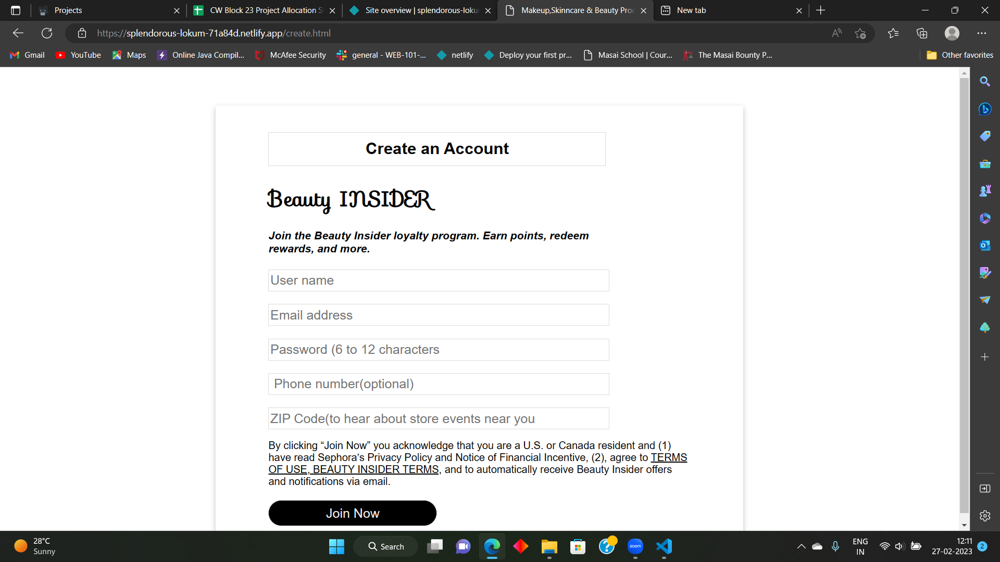

# verdant-attack-1980ia

# Makeup Website

Welcome to the Makeup Website project! This front-end project showcases makeup products and provides user authentication features for login and signup. Users can explore makeup products and add them to their cart.

## Table of Contents


- [Project Overview](home.png)

- [Features](cart.png)


## Project Overview

The Makeup Website is a front-end project designed to showcase makeup products and provide a user-friendly interface for exploring and shopping for makeup items. It includes the following features:

- **User Authentication**: Users can create accounts, log in, and manage their profiles.
- **Product Cards**: Display makeup products in visually appealing cards with product details.
- **Shopping Cart**: Users can add products to their cart for purchase.
- **Responsive Design**: The website is designed to work seamlessly on various devices and screen sizes.

## Features

- **User Authentication**:
  - Sign up with email and password.
  - Log in with registered credentials.
  - Profile management (update profile details).

- **Product Cards**:
  - Display makeup products with images, names, descriptions, and prices.
  - Clicking on a product card provides more details.

- **Shopping Cart**:
  - Add products to the cart.
  - View and update the cart contents.

## Technologies Used

- HTML
- CSS
- JavaScript
- GitHub

## Getting Started

Follow these steps to get the project up and running on your local machine.


##Deployed Link

   https://cool-rolypoly-b1333e.netlify.app/

### Prerequisites

To run this project locally, you need the following software/tools:

- Web browser (e.g., Chrome, Firefox)
- Text editor or code editor of your choice (e.g., Visual Studio Code)

### Installation

1. Clone the GitHub repository to your local machine:

   ```shell
   git clone https://github.com/Shubham17121999/makeup-website.git
